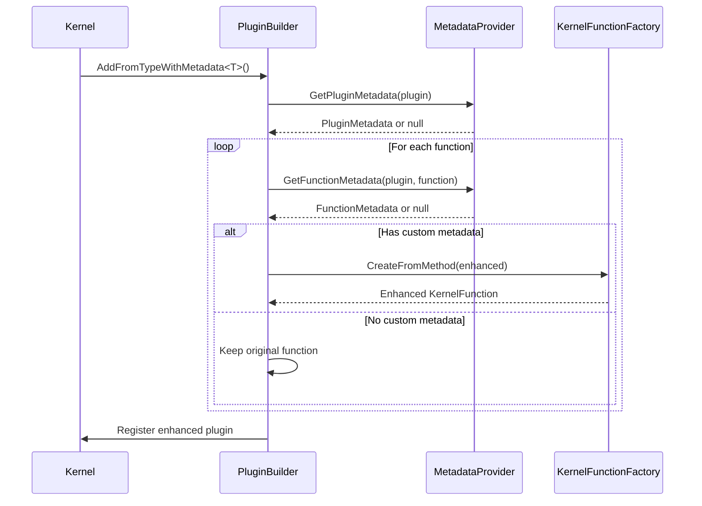

# Core Concepts

Understanding the core concepts of SemanticPluginForge will help you make the most of its capabilities.

## IPluginMetadataProvider Interface

The `IPluginMetadataProvider` interface is the foundation of SemanticPluginForge. It defines two methods:

```csharp
public interface IPluginMetadataProvider
{
    PluginMetadata? GetPluginMetadata(KernelPlugin plugin);
    FunctionMetadata? GetFunctionMetadata(KernelPlugin plugin, KernelFunctionMetadata metadata);
}
```

### GetPluginMetadata

This method allows you to override plugin-level metadata:

```csharp
public PluginMetadata? GetPluginMetadata(KernelPlugin plugin)
{
    return plugin.Name == "MyPlugin" ? new PluginMetadata
    {
        Description = "Enhanced plugin description"
    } : null;
}
```

### GetFunctionMetadata

This method allows you to override function-level metadata:

```csharp
public FunctionMetadata? GetFunctionMetadata(KernelPlugin plugin, KernelFunctionMetadata metadata)
{
    if (plugin.Name == "MyPlugin" && metadata.Name == "MyFunction")
    {
        return new FunctionMetadata(metadata.Name)
        {
            Description = "Enhanced function description",
            Parameters = new List<ParameterMetadata>
            {
                new ParameterMetadata("param1") 
                { 
                    Description = "Enhanced parameter description" 
                }
            }
        };
    }
    return null;
}
```

## Metadata Models

### PluginMetadata

Represents plugin-level metadata that can be overridden:

```csharp
public class PluginMetadata
{
    public string? Description { get; set; }
}
```

### FunctionMetadata

Represents function-level metadata that can be overridden:

```csharp
public class FunctionMetadata
{
    public string Name { get; }
    public string? Description { get; set; }
    public string? OverrideFunctionName { get; set; }
    public bool Suppress { get; set; }
    public IList<ParameterMetadata>? Parameters { get; set; }
    public ReturnParameterMetadata? ReturnParameter { get; set; }
}
```

### ParameterMetadata

Represents parameter-level metadata that can be overridden:

```csharp
public class ParameterMetadata : ParameterMetadataBase
{
    public string Name { get; }
    public string? Description { get; set; }
    public bool? IsRequired { get; set; }
    public object? DefaultValue { get; set; }
    public bool Suppress { get; set; }
}
```

## Plugin Enhancement Process

When you use SemanticPluginForge extension methods, the following process occurs:

1. **Original Plugin Analysis**: The `PluginBuilder` examines each function in the original plugin
2. **Metadata Retrieval**: For each function, it calls your `IPluginMetadataProvider` to get custom metadata
3. **Metadata Application**: If custom metadata is found, it creates a new function with the enhanced metadata
4. **Plugin Reconstruction**: A new plugin is created with all the enhanced functions
5. **Registration**: The enhanced plugin is registered with the Kernel



## Extension Methods

SemanticPluginForge provides several extension methods for different scenarios:

### Standard Plugin Registration with Metadata

```csharp
// From Type
kernelBuilder.Plugins.AddFromTypeWithMetadata<MyPlugin>();

// From Object
kernelBuilder.Plugins.AddFromObjectWithMetadata(new MyPlugin(), "PluginName");
```

### CLR Type Registration (No KernelFunction Required)

```csharp
// From CLR Type
kernelBuilder.Plugins.AddFromClrTypeWithMetadata<MyClass>("PluginName");

// From CLR Object
kernelBuilder.Plugins.AddFromClrObjectWithMetadata(new MyClass(), "PluginName");
```

## Best Practices

### 1. Provider Specificity

Make your metadata providers specific to avoid unintended side effects:

```csharp
public FunctionMetadata? GetFunctionMetadata(KernelPlugin plugin, KernelFunctionMetadata metadata)
{
    // Be specific about which plugins and functions to enhance
    if (plugin.Name == "SpecificPlugin" && metadata.Name == "SpecificFunction")
    {
        return new FunctionMetadata(metadata.Name) { /* enhancements */ };
    }
    return null;
}
```

### 2. Null Checks

Always return `null` when you don't want to provide custom metadata:

```csharp
public PluginMetadata? GetPluginMetadata(KernelPlugin plugin)
{
    // Return null for plugins you don't want to enhance
    return plugin.Name == "TargetPlugin" ? new PluginMetadata { /* ... */ } : null;
}
```

### 3. Dependency Injection

Register your metadata providers with appropriate lifetimes:

```csharp
// Singleton for stateless providers
services.AddSingleton<IPluginMetadataProvider, MyMetadataProvider>();

// Scoped for providers that need request-scoped data
services.AddScoped<IPluginMetadataProvider, RequestScopedProvider>();
```

### 4. Testing

Create unit tests for your metadata providers:

```csharp
[Test]
public void GetFunctionMetadata_ReturnsEnhancedMetadata_ForTargetFunction()
{
    var provider = new MyMetadataProvider();
    var plugin = /* create test plugin */;
    var metadata = /* create test metadata */;
    
    var result = provider.GetFunctionMetadata(plugin, metadata);
    
    Assert.That(result?.Description, Is.EqualTo("Expected description"));
}
```
