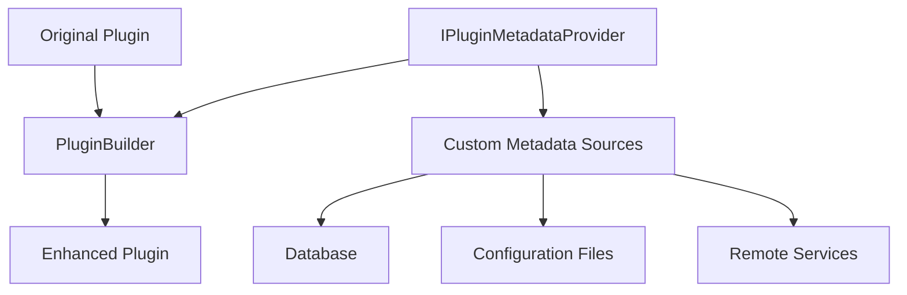

# Introduction

`SemanticPluginForge` is a powerful library that adds functionality to dynamically alter the metadata for SemanticKernel plugins. This library introduces the `IPluginMetadataProvider` interface, allowing for real-time updates to plugin metadata, including descriptions, return value descriptions, and parameter descriptions, without the need for redeployment.

## Key Benefits

### Dynamic Metadata Updates

- Make real-time updates to plugin metadata, enhancing flexibility and reducing downtime
- Implement changes without redeployment, ensuring a seamless update process

### Extensible Architecture

- Implement new metadata providers, such as a database-backed provider, to enable metadata changes without requiring a service restart
- Support various use cases and future expansions

### Dynamic Tuning

- Fine-tune plugin descriptions and parameters based on evolving requirements or user feedback
- Quickly respond to changes in business logic or user expectations without interrupting service availability

### Custom Metadata Providers

- Develop custom providers that fetch metadata from different sources, such as databases, remote services, or configuration management systems
- Achieve higher levels of customization and control over plugin behavior

## What You Can Do

With SemanticPluginForge, you can:

- **Override plugin and function descriptions** dynamically without code changes
- **Suppress functions or parameters** to hide them from consumers while maintaining functionality
- **Set default values for parameters** through metadata providers
- **Use any CLR type or object as a plugin** without requiring `KernelFunction` attributes
- **Override function names** to provide better naming conventions
- **Create multiple instances** of the same plugin with different metadata configurations

## Architecture Overview

The library is built around the `IPluginMetadataProvider` interface, which serves as the contract for providing custom metadata. The `PluginBuilder` class processes existing plugins and applies metadata overrides, creating new plugin instances with the updated information.

## Getting Started

Ready to enhance your Semantic Kernel plugins? Head over to the [Getting Started](getting-started.md) guide to begin your journey with SemanticPluginForge.
